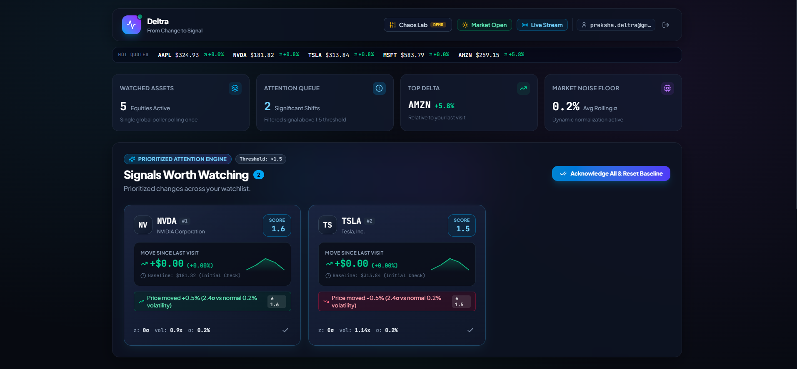
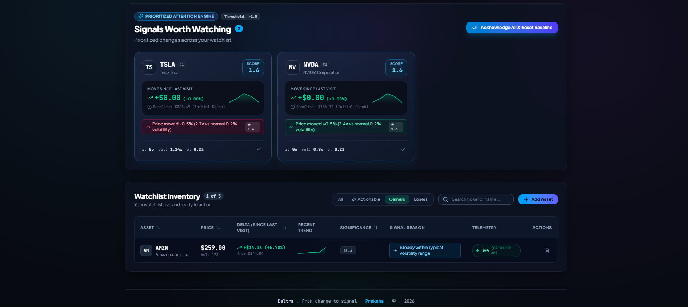
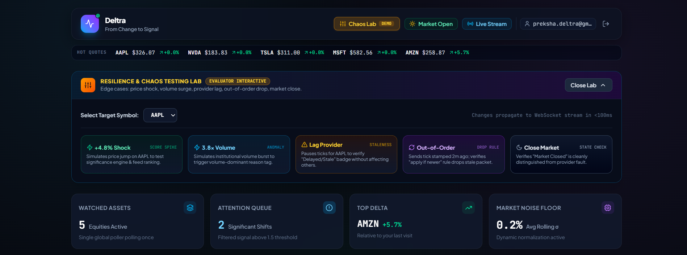
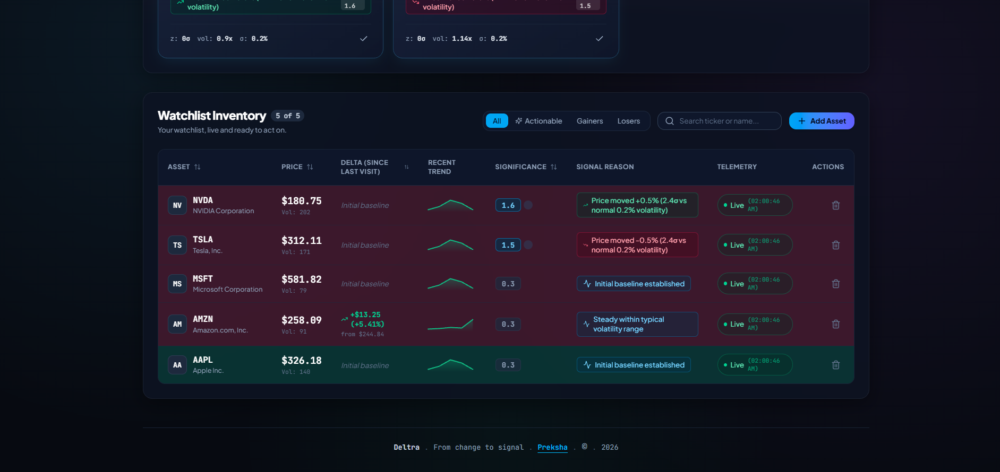

# Deltra — From Change to Signal

> **Deltra** is a market watchlist designed to surface what meaningfully changed while the user was away.

> **Market Data Note:** Market data in this submission is a real-time synthetic stream generated by the Market Data Simulator. The downstream architecture is provider-agnostic and can be connected to a live market-data provider with the existing watchlist, significance, persistence, and WebSocket layers remaining unchanged.

---

## Table of Contents
- [1. Executive Summary & Problem Framing](#1-executive-summary--problem-framing)
- [2. Visual Showcase & Screenshots](#2-visual-showcase--screenshots)
- [3. Design Trade-offs](#3-design-trade-offs)
  - [3.1 Synthetic data over a live market API](#31-synthetic-data-over-a-live-market-api)
  - [3.2 PostgreSQL over browser-local state](#32-postgresql-over-browser-local-state)
  - [3.3 Deterministic rules over LLM-generated explanations](#33-deterministic-rules-over-llm-generated-explanations)
  - [3.4 Redis + PostgreSQL](#34-redis--postgresql)
- [4. Core Technical Decisions & Rationale](#4-core-technical-decisions--rationale)
  - [4.1 Significance Scoring Algorithm](#41-significance-scoring-algorithm)
  - [4.2 Deterministic Reason Strings vs LLM Summaries](#42-deterministic-reason-strings-vs-llm-summaries)
  - [4.3 Persistent Server-Side Read Cursor (`user_symbol_state`)](#43-persistent-server-side-read-cursor-user_symbol_state)
  - [4.4 Resilience: Stale, Delayed, Closed & Out-of-Order Data](#44-resilience-stale-delayed-closed--out-of-order-data)
  - [4.5 Scaling Architecture & Symbol-Level Polling](#45-scaling-architecture--symbol-level-polling)
  - [4.6 Note on Simulated Market Data & Chaos Injection](#46-note-on-simulated-market-data--chaos-injection)
- [5. Complete System Architecture](#5-complete-system-architecture)
- [6. Data Models & Database Schema](#6-data-models--database-schema)
- [7. Watchlist Management Capabilities](#7-watchlist-management-capabilities)
- [8. Quick Start & Setup Guide](#8-quick-start--setup-guide)
- [9. Interactive Evaluator Tour (60-Second Demo Guide)](#9-interactive-evaluator-tour-60-second-demo-guide)
- [10. Automated Verification Test Suite](#10-automated-verification-test-suite)
- [11. Scaling Roadmap (What Changes at 10x Scale)](#11-scaling-roadmap-what-changes-at-10x-scale)

---

## 1. Executive Summary & Problem Framing

The conventional stock watchlist is a passive spreadsheet of tickers and fluctuating prices. When an investor checks a watchlist of 20+ assets, they are forced to visually scan numbers and parse market-open percentages that often reflect stale morning noise.

**Deltra rethinks this baseline:**
1. **Filtering Signal from Noise**: A flat `% move` threshold fails in production—it triggers false alarms on high-beta tech stocks and completely misses massive institutional moves on low-volatility names. This system computes a dynamic **Significance Score** per asset relative to that asset's **own rolling volatility ($\sigma$)**, volume anomalies, and structural breakouts.
2. **Prioritizing Attention**: The user interface is anchored around a ranked **"Signals Worth Watching" Attention Feed**, routing focus directly to the assets with the highest statistical anomalies since the user's previous visit.
3. **Cross-Session Durability**: "What changed since I last looked" is unique to each user. The baseline cursor lives in PostgreSQL, not in fragile browser `localStorage`.
4. **Resilient by Design**: Built to handle asynchronous network delays, out-of-order ticks, provider drops, and market closures with mathematically falsifiable rules.

---

## 2. Visual Showcase & Screenshots

### A. Main Dashboard Overview
*Live ticker tape ribbon, portfolio telemetry metric cards, the prioritized Attention Feed ("Signals Worth Watching"), and the complete Watchlist Inventory.*


*Figure 1: Full-featured dark terminal interface with live WebSocket stream beacon, market hours indicator, and metric cards.*

---

### B. "Signals Worth Watching" Prioritized Attention Feed
*Prioritized changes across your watchlist: Assets ranked dynamically by Significance Score, displaying SVG sparkline curves, delta vs your previous visit, mathematical telemetry (z-score, volume multiple, rolling σ), and deterministic explanation tags.*


*Figure 2: Attention Feed cards highlighting an asset that surged past the 1.5 threshold with a +5.8% (5.5σ) anomaly.*

---

### C. Evaluator & Chaos Testing Console
*Interactive testing lab enabling evaluators to inject price shocks, volume surges, provider lags, and out-of-order ticks live on screen.*


*Figure 3: Interactive chaos console with live terminal event logs and one-click baseline acknowledgment.*

---

### D. Watchlist Inventory & Management
*Full CRUD watchlist management with instant ticker search, segment filter tabs, live tick flashes, duplicate prevention, and deletion.*


*Figure 4: Watchlist inventory displaying in-table trendlines, baseline comparison, and 3-layer duplicate protection.*

---

## 3. Design Trade-offs

### 3.1 Synthetic data over a live market API
I chose a deterministic simulator so that I can reproduce price shocks, volume anomalies, stale providers, and out-of-order packets on demand without depending on market hours, API quotas, or third-party availability.

### 3.2 PostgreSQL over browser-local state
The "since you last checked" cursor is user state, so it belongs on the server rather than in localStorage. This keeps the baseline consistent across sessions and devices.

### 3.3 Deterministic rules over LLM-generated explanations
Attention decisions affect user trust, so the explanation must be reproducible. The system therefore uses deterministic scoring and reason templates rather than an LLM.

### 3.4 Redis + PostgreSQL
Redis handles high-frequency transient market state and fanout, while PostgreSQL owns durable user state and significant-event history.

---

## 4. Core Technical Decisions & Rationale

### 4.1 Significance Scoring Algorithm
The core scoring engine calculates:

```text
Score = [ 0.5 * min(price_z, 5) ] + [ 0.3 * min(volume_ratio, 3) ] + [ 0.2 * (level_break * 5) ]
        |-----------------------|   |----------------------------|   |---------------------------|
          Price Volatility Move             Volume Anomaly                Structural Breakout
```

```text
Where:
• price_z       = |% Price Change Since Baseline| / max(rolling_volatility_30, 0.2%)
• volume_ratio  = current_volume / 20_period_rolling_avg_volume
• level_break   = 1 if price crossed 52-week High/Low or 50 MA, else 0
```

* **Why Capped?**: Hard capping (price_z <= 5, volume_ratio <= 3) prevents a single bad tick, glitch, or flash crash from dominating the score linearly.
* **Why Volatility Floor?**: A floor of 0.2% prevents division-by-near-zero on flat assets, which would otherwise make a 0.05% fluctuation look infinitely significant.
* **Threshold**: Assets with a score >= 1.5 are flagged as **Meaningful** and surface in the Attention Feed.

---

### 4.2 Deterministic Reason Strings vs LLM Summaries
Every attention card displays a deterministic reason chip (e.g. *"Price moved +5.8% (5.5σ vs normal 1.1% volatility)"* or *"Volume spike: 3.8x 20-period average"*).  
* **Why not an LLM summary?**: LLM summaries are non-deterministic, have high latency, and cannot be defended in an audit ("Why did the model say that?"). A template-based rule derived directly from the dominant mathematical contributor is 100% testable, falsifiable, and instantaneous.

---

### 4.3 Persistent Server-Side Read Cursor (`user_symbol_state`)
Traditional financial apps calculate deltas from market open (9:30 AM). If a trader checks at 11:00 AM and returns at 3:00 PM, market-open delta is useless—it doesn't answer *"What happened while I was gone?"*

Each user has a persistent read cursor per symbol. The baseline is seeded when an asset is added and explicitly advanced when the user acknowledges the current state. When they return later, the server compares the current quote against that persisted cursor.

* Schema: `user_symbol_state(user_id, symbol, last_seen_price, last_seen_at, last_seen_volume)`
* Explicit advancement via **"Acknowledge All & Reset Baseline"** (`POST /watchlist/ack`) ensures the user controls when their baseline moves, avoiding accidental wipes on routine page reloads.
* Because state lives in PostgreSQL (not browser `localStorage`), the baseline is identical across devices, tabs, and browser refreshes.

---

### 4.4 Resilience: Stale, Delayed, Closed & Out-of-Order Data
The system explicitly handles 4 critical data failure modes:

| Failure Mode | How It Is Handled | User Visibility |
| :--- | :--- | :--- |
| **Stale Data** | If no tick arrives for > 8,000ms, quote is flagged `stale: true`. | Amber ` Delayed / Stale` badge with timestamp of last-known-good price. Never silently shows stale data as fresh. |
| **Market Closed** | Explicit system flag `marketStatus: 'closed'`. | Slate ` Market Closed` badge. Clearly distinguished from a data fault. |
| **Out-of-Order Ticks** | **"Apply if newer"** rule (`tick.timestamp <= existingQuote.timestamp`). | Older packets arriving late from congested routes are rejected and logged; never overwrites newer state. |
| **Provider Failure** | Handled on a per-symbol basis. | Failure of one stock does not impact the rest of the watchlist. |

---

### 4.5 Scaling Architecture & Symbol-Level Polling
The naive architecture of polling market data per-user, per-symbol scales O(Users × Symbols).

Within a single backend instance, the poller queries distinct watched symbols and generates one market stream per symbol, independent of the number of users watching it:
* The backend queries `SELECT DISTINCT symbol FROM watchlist_items` (merged with default core symbols) and **generates one polling stream per unique symbol within the backend instance** (O(Distinct Symbols)).
* Updates are fanned out to connected clients via **Redis Pub/Sub** keyed by symbol (`symbol:<ticker>`). Adding 10,000 users watching `AAPL` costs 10,000 WebSocket connections, but **only 1 upstream market stream**.

---

### 4.6 Note on Simulated Market Data & Chaos Injection
Real market APIs require paid enterprise subscriptions, enforce strict rate limits, and are completely closed on evenings and weekends. More importantly, **we cannot force a real API to experience a sudden +5% shock or network drop on demand**.  
The backend incorporates a configurable **Market Data Simulator** with an interactive **Chaos Lab**, allowing us to inject price shocks, volume surges, packet delays, and out-of-order ticks live on screen.

---

## 5. Complete System Architecture

```text
+-------------------------------------------------------------------------------+
|                                Fastify Backend                                |
|                                                                               |
|   +--------------------------+                                                |
|   |  Market Data Simulator   |                                                |
|   +------------+-------------+                                                |
|                | 1. Raw Simulated Tick                                        |
|                v                                                              |
|   +--------------------------+                                                |
|   |      Market Poller       |<--- Reads watched symbols from PostgreSQL      |
|   |    (Validation & Lag)    |                                                |
|   +------------+-------------+                                                |
|                | 2. Write Quote & Push 100-Tick Buffer                        |
|                v                                                              |
|   +--------------------------+                                                |
|   |     Redis Hot Cache      |                                                |
|   | (Quotes & Rolling Buffer)|                                                |
|   +------------+-------------+                                                |
|                | 3. Read Last 30 Ticks                                        |
|                v                                                              |
|   +--------------------------+                                                |
|   |   Significance Engine    |                                                |
|   | (Rolling sigma, Z-Score) |                                                |
|   +-----+----------------+---+                                                |
|         |                |                                                    |
|         | 4a. Anomaly    | 4b. Quote Updates & Meaningful Alerts              |
|         | (Score ≥ 1.5) |                                                    |
|         v                v                                                    |
|   +------------+   +-----------------------+                                  |
|   | PostgreSQL |   | Redis Pub/Sub Channel |                                  |
|   |  (Events)  |   |   (symbol:<ticker>)   |                                  |
|   +------------+   +-----------+-----------+                                  |
|                                |                                              |
|                                | 5. Fan-Out Dispatch                          |
|                                v                                              |
|                    +-----------------------+                                  |
|                    |   WebSocket Server    |                                  |
|                    +-----------+-----------+                                  |
+--------------------------------|----------------------------------------------+
                                 | 6. Real-Time WebSocket Push
                                 v
+-------------------------------------------------------------------------------+
|                              React + Vite Client                              |
|           [Live Ticker Ribbon]  [Attention Feed]  [Watchlist Inventory]       |
+-------------------------------------------------------------------------------+
```

**Execution Order for Market Updates:**
1. **Tick Generation**: The Market Data Simulator generates ticks according to geometric Brownian motion and configured chaos parameters.
2. **Poller Ingestion**: `MarketPoller` filters out-of-order packets ("apply if newer" rule) and detects provider lag (> 8s).
3. **Hot Cache Ingestion**: Valid ticks immediately update Redis `quote` keys and append to bounded 100-tick rolling buffers (`cache.pushTick`).
4. **Significance Evaluation**: The `SignificanceEngine` reads the last 30 ticks from the Redis rolling buffer to calculate rolling volatility (σ), 20-period volume ratios, and moving averages.
5. **Persistence & Fan-Out**:
   - If an anomaly is detected (Score ≥ 1.5), it persists to PostgreSQL (`significance_events`) and triggers an immediate alert.
   - Quote and anomaly events publish to Redis Pub/Sub (`symbol:<ticker>`).
6. **Client Streaming**: Fastify's WebSocket Server receives Redis Pub/Sub events and fans them out to all connected browser clients.

---

## 6. Data Models & Database Schema

```sql
-- 1. Users table (Authentication & identity)
CREATE TABLE users (
  id UUID PRIMARY KEY DEFAULT gen_random_uuid(),
  email TEXT UNIQUE NOT NULL,
  password_hash TEXT NOT NULL,
  created_at TIMESTAMPTZ DEFAULT now()
);

-- 2. Watchlist items (User portfolio subscriptions, enforces zero duplicates)
CREATE TABLE watchlist_items (
  id UUID PRIMARY KEY DEFAULT gen_random_uuid(),
  user_id UUID REFERENCES users(id) ON DELETE CASCADE,
  symbol TEXT NOT NULL,
  added_at TIMESTAMPTZ DEFAULT now(),
  UNIQUE(user_id, symbol)
);

-- 3. Per-user persistent read cursor per symbol (The basis of "what changed since last check")
-- Actively queried on GET /watchlist to calculate baseline deltas,
-- seeded on symbol creation, and advanced on POST /watchlist/ack ("Acknowledge All").
CREATE TABLE user_symbol_state (
  user_id UUID REFERENCES users(id) ON DELETE CASCADE,
  symbol TEXT NOT NULL,
  last_seen_price NUMERIC,
  last_seen_at TIMESTAMPTZ,
  last_seen_volume BIGINT,
  PRIMARY KEY (user_id, symbol)
);

-- 4. Active durable event audit log (Survives offline users & server restarts)
-- Actively populated on each anomaly (Score >= 1.5 or manual shock) in poller.ts,
-- and queried by GET /watchlist/feed (WHERE symbol = $1 AND detected_at > $2)
-- to reconstruct the Attention Feed relative to the user's cursor.
CREATE TABLE significance_events (
  id UUID PRIMARY KEY DEFAULT gen_random_uuid(),
  symbol TEXT NOT NULL,
  event_type TEXT NOT NULL,        -- 'price_move' | 'volume_spike' | 'level_break'
  score NUMERIC NOT NULL,
  detail JSONB,
  detected_at TIMESTAMPTZ DEFAULT now()
);
CREATE INDEX idx_events_symbol_time ON significance_events(symbol, detected_at DESC);

-- 5. Durable snapshot table (Redis hot cache crash recovery)
-- Actively populated via periodic 15-second background flush (flushSnapshotsToDb)
-- from Redis hot cache to PostgreSQL, guaranteeing cold-boot recovery if Redis restarts.
CREATE TABLE symbol_snapshots (
  symbol TEXT PRIMARY KEY,
  last_price NUMERIC,
  last_volume BIGINT,
  source TEXT,
  updated_at TIMESTAMPTZ
);
```

---

## 7. Watchlist Management Capabilities

* **Add Asset**: Add any US equity ticker via the `+ Add Asset` modal or select popular leaders (`AAPL`, `NVDA`, `TSLA`, `MSFT`, `AMZN`, `GOOGL`, `META`). Seeds initial baseline immediately.
* **Remove Asset**: Instant removal with the `🗑️` trash icon on each row. Deletes both the item and its baseline cursor.
* **Search & Filter**: Real-time ticker and name filtering, plus quick segment filter pills (`All`, `Actionable`, `Gainers`, `Losers`).
* **Duplicate Prevention**: 3-layer protection (UI disabled state, API `409 Conflict`, and database `UNIQUE(user_id, symbol)` constraint).
* **Cross-Session Persistence**: Sourced 100% from PostgreSQL on every session mount.

---

## 8. Quick Start & Setup Guide

### Prerequisites
- [Node.js 20+](https://nodejs.org/) installed.
- *Zero external setup required*: The repository includes an automated dual-mode adapter: it connects to real PostgreSQL and Redis if URLs are configured in `.env`, or automatically uses embedded in-process PostgreSQL (via `@electric-sql/pglite` WASM) and in-memory Redis for instant clone-and-run execution!

### Installation & Launch

#### 1. Start the Backend API & WebSocket Server
```bash
cd backend
npm install
npm run dev
```
* Backend starts at: `http://localhost:3001`
* Native WebSocket endpoint: `ws://localhost:3001/ws`

#### 2. Start the Frontend Terminal UI
In a new terminal window:
```bash
cd frontend
npm install
npm run dev
```
* Open your browser at: **`http://localhost:5173`**

#### 3. Instant Evaluator Login
The login screen includes pre-filled demo credentials:
* **Email**: `Preksha.Deltra@gmail.com`
* **Password**: `password123`
* Simply click **"Access Watchlist Terminal"** to enter.

---

## 9. Interactive Product Walkthrough

Explore Deltra's core capabilities through a quick walkthrough of its key market intelligence features.

1. **Verify Live Ticker Tape & WebSocket**: At the top navbar—the live ticker tape continuously scrolls real-time simulated prices with green/red flashes, and the radar beacon confirms the live WebSocket connection.
2. **Demonstrate Significance Engine**:
   - In the top right, click **"Chaos Lab"** to expand the evaluator console.
   - Select `AAPL` and click **`⚡ +4.8% Shock`**.
   - **Result**: AAPL immediately surges to **#1 in the Attention Feed** with a high score (e.g. `3.9`) and a reason chip showing multiple standard deviations (e.g. `5.5σ vs normal 1.1% volatility`).
3. **Demonstrate Volume Anomaly**:
   - Select `NVDA` and click **`📊 3.8x Volume`**.
   - **Result**: NVDA surfaces in the Attention Feed with a volume-dominant chip: `Volume spike: 3.8x 20-period average`.
4. **Demonstrate Stale Data Handling**:
   - Select `TSLA` and click **`⏳ Lag Provider`**.
   - **Result**: Ticks for TSLA stop. Within 8 seconds, its status badge transitions to **`⚠️ Delayed / Stale`** showing the last-known-good price, while all other stocks continue updating normally.
5. **Demonstrate Out-of-Order Packet Drop**:
   - Select `MSFT` and click **`🔄 Out-of-Order`**.
   - **Result**: A backdated packet (2 minutes in the past) is dispatched. The terminal log confirms it was safely dropped under the **"apply if newer"** rule without overwriting newer state.
6. **Demonstrate Market Closed vs Error**:
   - Click **`🌙 Close Market`**.
   - **Result**: Badges cleanly transition to **`Market Closed`** across all assets, demonstrating that closed sessions are never confused with system errors.
7. **Demonstrate Baseline Reset**:
   - In the Attention Feed, click **"Acknowledge All & Reset Baseline"**.
   - **Result**: The attention queue clears to 0 and all baselines reset to current market prices.
8. **Demonstrate Durability (`Ctrl + F5`)**:
   - Press `Ctrl + F5` or close and reopen the browser.
   - **Result**: The exact watchlist, active assets, and baseline prices reload from PostgreSQL.

---

## 10. Automated Verification Test Suite

Run the backend mathematical and resilience test suite:
```bash
cd backend
npm test
```

### Test Coverage
- `calculateRollingVolatility`: Verifies standard deviation math and checks that the `0.2%` volatility floor protects against division-by-zero.
- `calculateAverageVolume`: Verifies 20-period rolling volume averaging.
- `checkLevelBreaks`: Verifies detection of 52-week High/Low and 50-day Moving Average breakouts.
- `calculateSignificance`: Tests capping logic to ensure outlier spikes do not blow up scores linearly, and verifies deterministic reason string generation.

---

## 11. Scaling Roadmap (What Changes at 10x Scale)

| Component | Hackathon Architecture | Production at 10x Scale |
| :--- | :--- | :--- |
| **Time-Series Storage** | Redis 100-tick bounded ring buffer | Dedicated time-series database (TimescaleDB / InfluxDB) for multi-month backtesting and historical lookbacks. |
| **WebSocket Layer** | Single-node Fastify WebSocket manager | Sharded WebSocket nodes clustered across a Redis or NATS Pub/Sub backbone keyed by symbol hash. |
| **Stream Ingestion** | In-process timer poller | Distributed stream processing pipeline (Apache Kafka / Flink) with distributed leader election to ingest sub-millisecond market feeds. |
| **Client Baseline Caching** | Server-side PostgreSQL read cursor on fetch | Hybrid write-through cache in Redis storing per-user read pointers with lazy write-back to PostgreSQL. |

---

<div align="center">
  <sub>Deltra . From change to signal . <a href="https://www.linkedin.com/in/preksha-prakash-">Preksha</a> . &copy; . 2026</sub>
</div>
